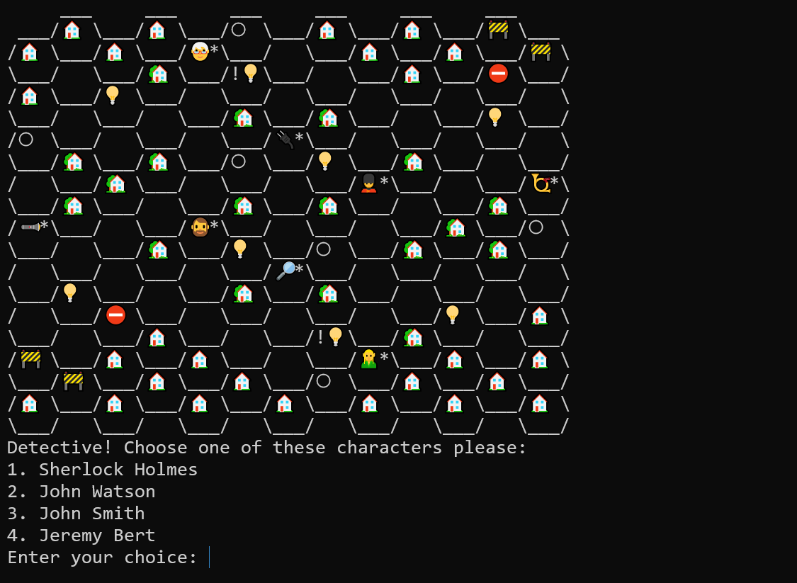

# Mr. Jack Board Game in C

## Description
This project is a C language implementation of the popular board game Mr. Jack. The game features a command-line interface (CLI) and is designed for two players, with one taking on the role of Mr. Jack and the other playing as the detective. The objective is to deduce or conceal the identity of Mr. Jack, depending on the role.

## Game Screenshot


## Features
- Text-based command-line user interface.
- Strategic gameplay mechanics faithful to the original board game.
- Player roles: Detective and Mr. Jack.
- Dynamic game board setup and character movement.

## Technologies Used
- **C**: Main programming language.
- **GCC**: Recommended compiler.

## Installation
To run this game, you will need a C compiler like GCC installed on your machine.

Clone the repository:
```bash
git clone https://github.com/FDorj/Mr.Jack-in-C
```

Compile the program:
```bash
gcc main.c -o mrjack
```

## Usage
To start the game, run the following command in the terminal:
```bash
./mrjack
```

Follow the on-screen prompts to choose characters and make game moves.

## Contributing
Contributions are welcome! Please fork the repository and open a pull request with your improvements. For major changes, please open an issue first to discuss what you would like to change.


## Authors
- Fatemeh Dorj-f.dorj2@gmail.com
 
## Project Link
[Mr. Jack Board Game in C](https://github.com/FDorj/Mr.Jack-in-C)

